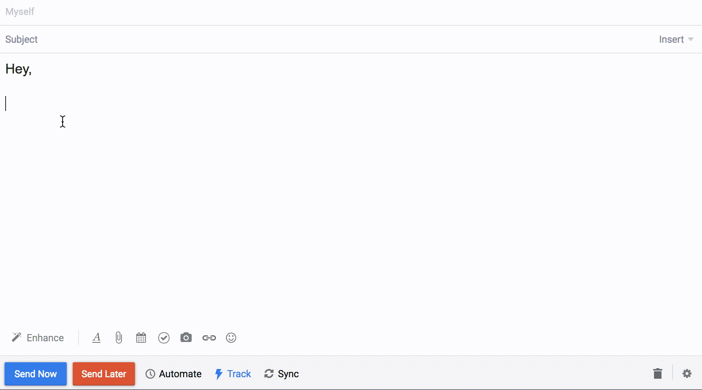
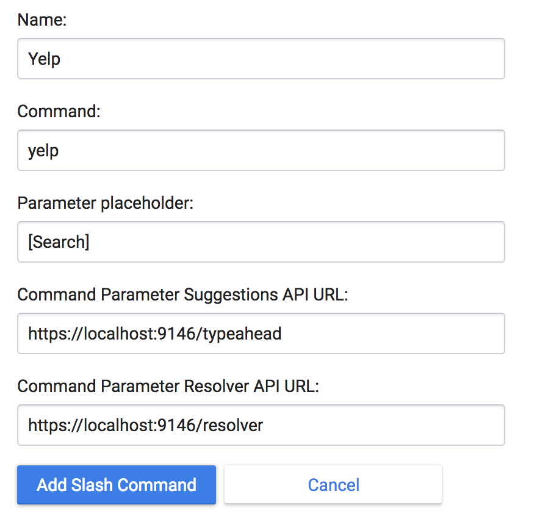

# mixmax-yelp
Yelp integration for Mixmax email client

https://www.yelp.com/developers/documentation/v3

# Yelp integration for Mixmax
This is an open source Mixmax Slash Command. See [Mixmax slash command](http://developer.mixmax.com/docs/overview-slash-commands#tutorial-building-mygiphy) for more information on building integrations in Mixmax.

## Demo
After following the setup instructions below, you should be able to trigger the integration with the `/yelp` command in your email client. It should look like this:

## Setup and running locally
1. Make a copy of `/utils/_yelp.js` as `/utils/yelp.js`. Register a Yelp developer API key [here](https://www.yelp.com/developers/documentation/v3) and fill in the necessary fields
1. Install dependencies using `npm i`
1. Run server using `npm start`

## Why do we run it in https locally?
Mixmax slash command APIs are required to be served over https. This is because they are queried directly from the Mixmax client in the browser (using AJAX) that's running on an HTTPS domain. Browsers forbid AJAX requests from https domains to call http APIs, for security. So we must run an https server with a locally-signed certificate.

## Adding the slash command in Mixmax
1. Go to your [Mixmax integration settings panel](https://app.mixmax.com/dashboard/settings/integrations)
1. Click **Add Slash Command** and enter the following values:
  

Detailed instructions can be found [here](https://mixmax.com/blog/giphy-slash-command).
